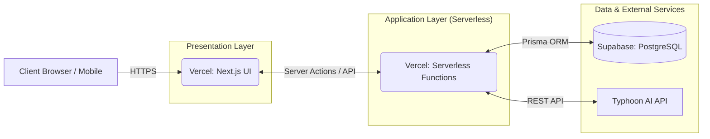
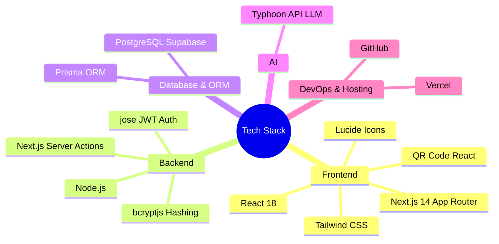

# Event Feedback Intelligence 🎯

ระบบจัดทำและประเมินผลความพึงพอใจของการจัดกิจกรรม พร้อมระบบ AI สรุปผลอัจฉริยะ (Deploy บน Vercel + Supabase)

## 📊 ประเมินผลงานตัวเอง (Self-Evaluation)
**ความคืบหน้าของโปรเจกต์: 100% (ดำเนินการแล้วเสร็จสมบูรณ์)**
- ✅ **Frontend & UI:** พัฒนาระบบ Dashboard, ระบบสร้าง QR Code, และฟอร์มสำหรับแขกผู้เข้าร่วมงาน (รองรับ Mobile)
- ✅ **Backend & Auth:** ระบบ Login/Register เข้ารหัสแบบ Bcrypt และ JWT (jose)
- ✅ **Database:** ออกแบบ Schema และเชื่อมต่อกับ PostgreSQL (Supabase) ผ่าน Prisma ORM
- ✅ **AI Integration:** เชื่อมต่อกับ Typhoon AI (LLM) เพื่อวิเคราะห์สรุปผล (Insights) จากคำติชมของผู้เข้าร่วมงานโดยอัตโนมัติ
- ✅ **Deployment:** อัปโหลดขึ้น Production Server (Vercel) และฐานข้อมูลคลาวด์สำเร็จ สามารถใช้งานได้จริง

---

## 🏗️ System & Microservices Architecture
ระบบถูกออกแบบในลักษณะ Managed Services & Serverless Architecture โดยแยกส่วนประกอบออกจากกันเพื่อให้ดูแลรักษาและขยายสเกลได้ง่าย (Decoupled Services)

---

## 💻 Technology Stack Diagram
เทคโนโลยีที่เลือกใช้ในโปรเจกต์นี้ เป็น Modern Tech Stack ยอดนิยมที่เน้นประสิทธิภาพและความปลอดภัย

---

## 🚀 Live Demo
สามารถเข้าใช้งานระบบได้ที่: [https://sub-test-git-main-natakorn1.vercel.app/](https://sub-test-git-main-natakorn1.vercel.app/)
