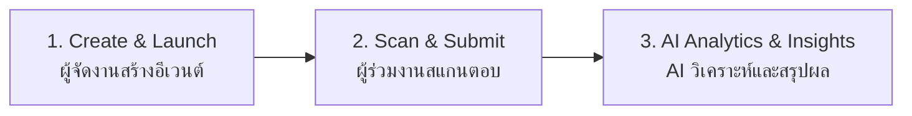

# 📽️ Event Feedback Intelligence — Presentation Slides

---

## 🖥️ Slide 1: หน้าปก (Title Slide)

- **ชื่อโปรเจกต์:** Event Feedback Intelligence
- **สโลแกน / คอนเซ็ปต์:** AI-Powered Event Feedback & Sentiment Analytics Platform
- **คำโปรย:** *"เปลี่ยนฟีดแบ็กงานกิจกรรมให้เป็นข้อมูลเชิงลึกที่จับต้องได้ ด้วยระบบสำรวจและวิเคราะห์อัจฉริยะ"*
- **ผู้พัฒนา / ผู้นำเสนอ:** 67160170 นายนนทพัทธ์ วงเครือศร 67160213 นายณฐกร ขาวใหญ่

---

## 💡 Slide 2: โปรเจกต์เราทำอะไร? (Project Overview)

> **วัตถุประสงค์:** แก้ปัญหาการทำแบบประเมินแบบเดิมที่ผู้เข้าร่วมงานไม่อยากทำ และผู้จัดงานสรุปผลได้ช้า

1. **ศูนย์กลางการจัดการงานของผู้จัด (Organizer Dashboard):**
   - สร้างและจัดการแบบประเมินกิจกรรมได้ง่ายในที่เดียว
   - สร้าง QR Code อัตโนมัติเพื่อให้ผู้ร่วมงานสแกนตอบได้ทันทีผ่านมือถือ ไม่ต้องดาวน์โหลดแอป
2. **หน้าทำแบบสอบถามที่เป็นมิตร (Frictionless Survey):**
   - ดีไซน์สวยงาม น่าใช้งาน ให้คะแนนง่าย และรองรับทั้งบนมือถือและคอมพิวเตอร์
3. **ระบบ AI Intelligence Summary:**
   - AI ช่วยประมวลผล สรุปใจความสำคัญจากทุกคำตอบ และจำแนกจุดแข็ง (*Key Highlights*) รวมถึงจุดที่ควรพัฒนา (*Areas for Improvement*) ให้ทันทีในคลิกเดียว

---

## 🔄 Slide 3: กระบวนการทำงานของระบบ (Workflow)

- **Create & Launch:** ผู้จัดงานสร้างอีเวนต์และชุดคำถามประเมิน
- **Scan & Submit:** ผู้เข้าร่วมสแกน QR Code แล้วประเมินคะแนน 1–5 พร้อมใส่ข้อเสนอแนะ
- **AI Analytics & Insights:** ระบบรวบรวมคะแนนเฉลี่ย และให้ AI สรุปผลภาพรวมออกมาเป็นข้อคิดเห็นเชิงกลยุทธ์สำหรับผู้จัดงาน

---

## 🚀 Slide 4: สิ่งที่อัปเดตจากสัปดาห์ก่อนหน้า (Weekly Progress & Updates)

> **โฟกัสหลักของสัปดาห์นี้:** จากสัปดาห์ก่อนหน้าที่ระบบทำงานหลักได้แล้วทั้งบนมือถือและคอมพิวเตอร์ สัปดาห์นี้ได้มุ่งเน้นการตกแต่งธีม ออกแบบ Visual Identity และเก็บรายละเอียด UX/UI ให้สวยงามและน่าใช้งานอย่างเต็มรูปแบบ

### 1. ตกแต่งธีมและระบบดีไซน์ใหม่ทั้งหมด (Theme & Visual Identity)
- ออกแบบธีม **Modern Pastel & Glassmorphism** (โทนสีชมพู-ลาเวนเดอร์) ให้ความรู้สึกสดใส เป็นมิตร และดูเป็นมืออาชีพ
- คลีนเลย์เอาต์หน้าจอให้น่ามอง นำส่วนจำลองที่รกตาออก เพื่อเน้นข้อมูลงานจริงของผู้จัดงาน

### 2. ยกระดับหน้าแดชบอร์ดผู้จัดงาน (Dashboard Polish)
- ปรับแถบเมนูด้านบน (Global Nav) ให้เต็มจอ Edge-to-Edge สวยงามทั้งบนคอมและมือถือ พร้อมระบบ Smart Routing คลิกโลโก้เพื่อกลับแดชบอร์ดได้ทันที
- ดีไซน์กล่องสถิติ **"กิจกรรมทั้งหมด"** ใหม่อยู่ในบรรทัดเดียว เป็นชิปสีชมพูพาสเทลเด่นชัด กวาดตามองเห็นตัวเลขได้ในพริบตา

### 3. ปรับปรุงและตกแต่งหน้าทำแบบประเมิน (Survey UI/UX Polish)
- จัดหัวข้อแบบสอบถามและข้อมูลงานให้ใหญ่ขึ้นและจัดชิดซ้ายอย่างเป็นระเบียบ
- ดีไซน์ปุ่มให้คะแนน 1–5 ใหม่เป็น **Grid Tiles 5 ช่อง** สัดส่วนพอดีทั้งบนจอคอมและมือถือ กดง่าย มีแสงเงาตอบสนอง ไม่ห่างกันเกินไป
- ขยายขนาดตัวหนังสือคำถามแต่ละข้อให้ใหญ่ขึ้นเป็น **18px ตัวหนา** อ่านง่าย ชัดเจนในทุกขนาดหน้าจอ

### 4. เพิ่มระบบแจ้งเตือนฟิลด์บังคับที่ชัดเจน (Interactive Notice)
- ส่วน "ข้อเสนอแนะเพิ่มเติม" เพิ่มป้ายเตือนสะดุดตา `⚠️ จำเป็นต้องกรอก` และเปลี่ยนเป็นสถานะ `✓ กรอกเรียบร้อยแล้ว` เมื่อพิมพ์ข้อความ ป้องกันการสับสนก่อนกดส่ง

### 5. เพิ่มความมีชีวิตชีวาด้วย Mascot SVG น้อง AI
- ออกแบบตัวการ์ตูนมาสคอต 3D Claymation โทนพาสเทล ในรูปแบบไฟล์ `.svg` โปร่งใส พร้อมแอนิเมชันลอยนุ่มนวล (*Floating Animation*) ในสถานะรอนำเสนอผลสรุปฟีดแบ็ก

---

## 📊 Slide 5: ตารางเปรียบเทียบ ก่อน - หลัง การพัฒนา (Before vs After)

| หัวข้อ | สัปดาห์ก่อนหน้า (Previous Week) | การอัปเดตสัปดาห์นี้ (Current Week) |
| :--- | :--- | :--- |
| **ธีมและการตกแต่ง (Theming)** | หน้าเว็บโครงสร้างพื้นฐาน ใช้งานได้แต่ยังไม่ได้ตกแต่งธีม | ตกแต่งธีม Pastel Glassmorphism สดใส ทันสมัย และเป็นมืออาชีพ |
| **ความสะอาดของหน้าจอ (UI Cleanup)** | มีองค์ประกอบจำลองและไอคอนที่ยังไม่ได้จัดระเบียบ | คลีน UI ใหม่ทั้งหมด เน้นข้อมูลจริง ตัวเลขสถิติเด่นชัดในแถวเดียว |
| **ปุ่มให้คะแนน (Rating Scale)** | ปุ่มวงกลมขนาดเล็ก ระยะห่างเยอะบนจอคอม | ปรับเป็น Grid Tiles 5 ช่องเต็มพื้นที่ กดง่าย สวยงามทั้งคอมและมือถือ |
| **ขนาดคำถาม (Question Typography)** | ตัวหนังสือคำถามขนาดทั่วไป (15px) | ขยายใหญ่ขึ้นเป็น 18px ตัวหนา อ่านง่ายสบายตาทันที |
| **ฟิลด์ข้อเสนอแนะ (Required Field)** | ข้อความเตือนธรรมดา ไม่สะดุดตา | ป้ายเตือนไฮไลต์ชัดเจน พร้อมระบบเช็กสถานะการกรอกแบบเรียลไทม์ |
| **หน้ารอฟีดแบ็ก (Empty State)** | ไอคอนประกายดาวเรียบๆ | ตัวการ์ตูนมาสคอตน้อง AI 3D แบบ SVG โปร่งใส ดุ๊กดิ๊กลอยได้ |

---

## 🎯 Slide 6: แผนการดำเนินงานในสัปดาห์ถัดไป (Next Steps)
- [ ] พัฒนาระบบ Export ข้อมูลสรุปผลการประเมินออกมาเป็นไฟล์ PDF / Excel
- [ ] เพิ่มกราฟแท่งหรือแผนภูมิวงกลม (Charts) จำแนกสัดส่วนคำตอบในแต่ละข้อ
- [ ] ทดสอบการใช้งานจริง (User Testing) กับกลุ่มผู้ร่วมกิจกรรมต้นแบบ

---

# 🎙️ Script Presentation (บทพูดนำเสนอ 3 นาที)

> **⏱️ ความยาวรวม:** ประมาณ 2 นาที 45 วินาที – 3 นาที  
> **👥 ผู้นำเสนอ:** นายนนทพัทธ์ วงเครือศร & นายณฐกร ขาวใหญ่

---

### 📍 สไลด์ที่ 1: หน้าปก `[0:00 – 0:25 | 25 วินาที]`

> **🗣️ คำพูดนำเสนอ:**  
> *"สวัสดีอาจารย์และเพื่อนๆ ทุกคนครับ พวกเรากลุ่มพัฒนาโปรเจกต์ **Event Feedback Intelligence** สมาชิกประกอบด้วย ผม นายนนทพัทธ์ วงเครือศร และ นายณฐกร ขาวใหญ่ ครับ*  
> 
> *โปรเจกต์ของเราคือ **แพลตฟอร์มสำรวจและวิเคราะห์ฟีดแบ็กงานกิจกรรมด้วย AI** ภายใต้แนวคิด **'เปลี่ยนฟีดแบ็กงานกิจกรรมให้เป็นข้อมูลเชิงลึกที่จับต้องได้'** ครับ"*

---

### 📍 สไลด์ที่ 2: ปัญหาและแนวคิดของโปรเจกต์ `[0:25 – 0:55 | 30 วินาที]`

> **🗣️ คำพูดนำเสนอ:**  
> *"จุดเริ่มต้นของโปรเจกต์นี้ เกิดจากปัญหาคลาสสิกของแบบประเมินทั่วไป คือ **'ผู้ร่วมงานไม่อยากตอบเพราะยุ่งยาก และผู้จัดงานก็สรุปผลได้ช้า'** ระบบของเราจึงเข้ามาตอบโจทย์ด้วย 3 จุดเด่นหลักครับ:*  
> 
> 1. **Organizer Dashboard:** ศูนย์กลางจัดการงานของผู้จัด พร้อมสร้าง QR Code ให้ผู้ร่วมงานสแกนตอบได้ทันที ไม่ต้องโหลดแอป  
> 2. **Frictionless Survey:** หน้าแบบสอบถามที่ออกแบบมาให้ตอบง่าย สบายตา ใช้งานสะดวกทั้งบนคอมและมือถือ  
> 3. **AI Intelligence Summary:** มี AI ช่วยอ่านทุกคอมเมนต์ สรุปภาพรวม ไฮไลต์จุดแข็ง และชี้จุดที่ต้องปรับปรุงให้ผู้จัดงานในคลิกเดียวครับ"*

---

### 📍 สไลด์ที่ 3: กระบวนการทำงาน 3 ขั้นตอน `[0:55 – 1:25 | 30 วินาที]`

> **🗣️ คำพูดนำเสนอ:**  
> *"สำหรับกระบวนการทำงานของระบบ จะถูกแบ่งออกเป็น 3 ขั้นตอนที่เรียบง่ายและเชื่อมโยงกันครับ:*  
> 
> - **ขั้นที่ 1 Create & Launch:** ผู้จัดงานสร้างอีเวนต์และชุดคำถาม ระบบจะสร้าง QR Code ให้ทันที  
> - **ขั้นที่ 2 Scan & Submit:** ผู้เข้าร่วมงานสแกน QR Code เพื่อให้คะแนนความพึงพอใจ 1–5 ดาว และพิมพ์ข้อเสนอแนะผ่านมือถือ  
> - **ขั้นที่ 3 AI Analytics & Insights:** ระบบจะคำนวณคะแนนเฉลี่ยแบบเรียลไทม์ และให้ AI สรุปผลการประเมินออกมาเป็นข้อคิดเห็นเชิงกลยุทธ์ เพื่อให้ผู้จัดงานนำไปพัฒนาการจัดงานครั้งต่อไปได้ทันทีครับ"*

---

### 📍 สไลด์ที่ 4: สิ่งที่อัปเดตในสัปดาห์นี้ `[1:25 – 2:05 | 40 วินาที]` ⭐ *[จุดเน้น]*

> **🗣️ คำพูดนำเสนอ:**  
> *"สำหรับความก้าวหน้าในสัปดาห์นี้ ต่อเนื่องจากสัปดาห์ก่อนหน้าที่ระบบฟังก์ชันหลักทำงานได้แล้ว สัปดาห์นี้เราจึงมุ่งเน้นการ **'ตกแต่งธีม ออกแบบ Visual Identity และยกระดับ UX/UI สู่ระดับ Production'** ทั้งหมด 5 เรื่องด้วยกันครับ:*  
> 
> 1. **Theme & Visual Identity:** ปรับธีมใหม่เป็น Modern Pastel & Glassmorphism สดใส สบายตา และคลีนส่วนจำลองที่รกตาออก  
> 2. **Dashboard Polish:** เมนูเต็มจอ Edge-to-Edge รองรับ Responsive และปรับสถิติจำนวนกิจกรรมให้อ่านง่ายในบรรทัดเดียว  
> 3. **Survey UI/UX Redesign:** จัดหัวข้อแบบสอบถามชิดซ้าย ขยายตัวหนังสือคำถามเป็น 18px ตัวหนา และเปลี่ยนปุ่มคะแนนเป็น Grid Tiles 5 ช่องเต็มพื้นที่ กดง่ายทั้งบนคอมและมือถือ  
> 4. **Interactive Validation:** เพิ่มป้ายเตือนสะดุดตา 'จำเป็นต้องกรอก' และเช็กสถานะการกรอกแบบเรียลไทม์  
> 5. **Branded Mascot:** ออกแบบน้องมาสคอต AI 3D เวกเตอร์ SVG โปร่งใส พร้อมแอนิเมชันลอยเบาๆ ในสถานะรอผลฟีดแบ็กครับ"*

---

### 📍 สไลด์ที่ 5: เปรียบเทียบ ก่อน - หลัง การพัฒนา `[2:05 – 2:35 | 30 วินาที]`

> **🗣️ คำพูดนำเสนอ:**  
> *"จากตารางเปรียบเทียบ จะเห็นความเปลี่ยนแปลงอย่างชัดเจนครับ จากเดิมที่เป็นโครงสร้างหน้าเว็บพื้นฐานที่ยังไม่ได้ตกแต่งธีม ปุ่มคะแนนเล็กและห่างกันเกินไป รวมถึงตัวหนังสือที่ค่อนข้างเล็ก  
> 
> ในสัปดาห์นี้ ทุกส่วนถูกปรับให้สอดคล้องเป็นหนึ่งเดียว หน้าจอดูโปร่งสบายตา ปุ่มคะแนนและฟอนต์มีขนาดใหญ่ขึ้น อ่านง่ายบนทุกอุปกรณ์ และมีสถานะแจ้งเตือนที่ชัดเจน ทำให้ผู้ตอบแบบสอบถามได้รับประสบการณ์ที่ดีขึ้นอย่างก้าวกระโดดครับ"*

---

### 📍 สไลด์ที่ 6: แผนในสัปดาห์ถัดไป & สรุปจบ `[2:35 – 3:00 | 25 วินาที]`

> **🗣️ คำพูดนำเสนอ:**  
> *"ก้าวต่อไปในสัปดาห์ถัดไป เราวางแผนพัฒนา 3 ส่วนหลักครับ:*  
> 
> - พัฒนาระบบ Export ข้อมูลออกมาเป็นไฟล์ PDF และ Excel สำหรับทำรายงาน  
> - เพิ่ม Interactive Charts กราฟแท่งและแผนภูมิวงกลมจำแนกคะแนน  
> - และนำระบบไปทดสอบการใช้งานจริง (UAT) กับกลุ่มผู้ร่วมกิจกรรมต้นแบบครับ  
> 
> *กลุ่มพวกเราขอจบการนำเสนอเพียงเท่านี้ ขอบคุณอาจารย์และเพื่อนๆ ทุกคนครับ ยินดีรับฟังคำแนะนำและคำถามครับ"*
