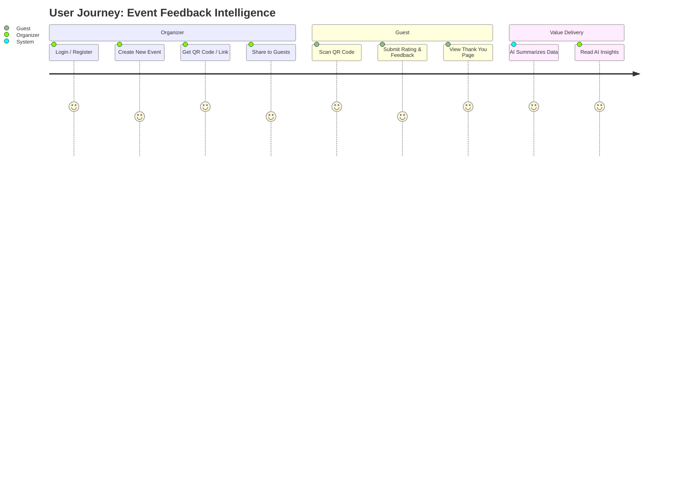

# User Journey Map: Event Feedback Intelligence 🚀

ระบบ **Event Feedback Intelligence** ถูกออกแบบมาเพื่อรองรับผู้ใช้งาน 2 กลุ่มหลัก ได้แก่ **ผู้จัดงาน (Organizer)** และ **ผู้เข้าร่วมงาน (Guest)** โดยมีเส้นทางการใช้งาน (User Journey) ดังนี้:

---

## 👨‍💼 1. ผู้จัดงาน (Organizer Journey)
*เป้าหมาย: สร้างฟอร์มประเมินอย่างรวดเร็ว และได้รับผลสรุปจาก AI ทันทีโดยไม่ต้องอ่านทีละอัน*

1. **เข้าสู่ระบบ (Onboarding / Login)**
   - ผู้ใช้เข้าสู่เว็บไซต์ และทำการสมัครสมาชิก หรือเข้าสู่ระบบ
2. **หน้าหลัก (Dashboard)**
   - ระบบแสดงหน้า Dashboard ซึ่งรวบรวม Event ทั้งหมดที่เคยสร้างไว้
3. **สร้างงานใหม่ (Create Event)**
   - ผู้ใช้คลิก "สร้างงานใหม่" กรอกชื่อกิจกรรม, คำอธิบายสั้นๆ และอัปโหลดรูปหน้าปก (Cover Image)
4. **รับช่องทางการแชร์ (Share & Distribution)**
   - ระบบสร้างหน้าสำหรับให้ผู้เข้าร่วมงานประเมินผลโดยอัตโนมัติ
   - ระบบแสดง **QR Code** และ **URL Link** สำหรับแชร์
   - ผู้จัดงานนำ QR Code ขึ้นจอ Projector หรือแชร์ลิงก์ในกลุ่มแชท
5. **ดูผลวิเคราะห์ (AI Insights Analysis)**
   - หลังจากจบงาน ผู้จัดงานกลับมาที่ Dashboard และคลิกเข้าไปดูผลการประเมิน
   - ระบบแสดงคะแนนเฉลี่ย (Average Rating)
   - **Typhoon AI** ทำการวิเคราะห์คำติชม (Feedback Text) ทั้งหมด และสรุปออกมาเป็น 3 หัวข้อ:
     - 📌 สิ่งที่ผู้เข้าร่วมประทับใจ
     - 📌 ข้อเสนอแนะ/จุดที่ควรปรับปรุง
     - 📌 สรุปภาพรวมและแนวทางแก้ไขในอนาคต

---

## 🙋‍♂️ 2. ผู้เข้าร่วมงาน (Guest / Respondent Journey)
*เป้าหมาย: สามารถให้คะแนนและคำติชมได้อย่างรวดเร็ว โดยไม่ต้องสมัครสมาชิกและไม่ต้องผ่านหลายขั้นตอน*

1. **เข้าถึงฟอร์มประเมิน (Access Point)**
   - ผู้ร่วมงานสแกน QR Code หน้างาน หรือคลิกลิงก์จากในกลุ่มแชท
2. **ทำแบบประเมิน (Evaluation Form)**
   - ระบบพาเข้าสู่หน้าฟอร์มประเมิน (รองรับการแสดงผลบนมือถือแบบ 100%)
   - แสดงภาพหน้าปกและรายละเอียดงานให้ผู้ร่วมงานทราบ
   - ผู้ร่วมงานกดให้คะแนนความพึงพอใจ (1 ถึง 5 ดาว)
   - ผู้ร่วมงานพิมพ์ข้อความคำติชม ความประทับใจ หรือข้อเสนอแนะ
3. **ส่งข้อมูล (Submit)**
   - ผู้ร่วมงานกดยืนยันการส่งข้อมูล
4. **เสร็จสิ้น (Completion)**
   - ระบบแสดงหน้าจอ **"ขอบคุณสำหรับคำติชม"** (Thank You Page)
   - สิ้นสุดกระบวนการ

---

### แผนภาพสรุปการทำงาน (Workflow Diagram)

